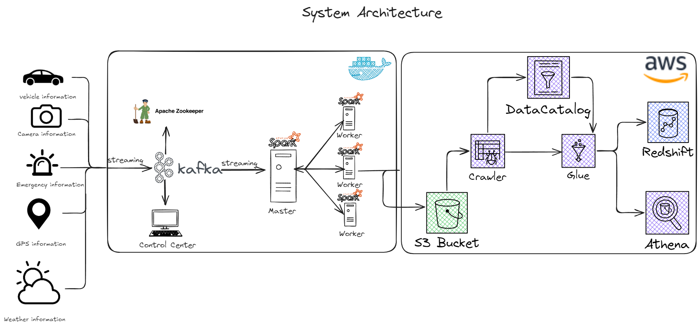

# Urban Mobility Data Processing and Simulation

### Background of the Project

This project explores the integration of Big Data, the Internet of Things (IoT), and cloud computing to enhance urban mobility. The case study involves a driver's journey from San Francisco, CA, to Dublin, CA, covering approximately 35 miles. This scenario demonstrates how real-time data collection and analysis can significantly improve the driving experience by optimizing route selection, reducing travel times, and enhancing safety. The project collects and processes real-time data on vehicle performance, GPS tracking, weather conditions, traffic congestion, and emergency incidents.

## System Architecture

The project's architecture is designed to be scalable, fault-tolerant, and capable of processing real-time data. A master-worker architecture, it integrates Docker containers for deploying services like Zookeeper, Kafka, and Apache Spark. AWS Cloud services are used for storage, data warehousing, and analytics, while IoT services facilitate data collection from various sources.

## Starting the Project with Docker Compose

Docker Compose defines and manages the multi-container Docker applications necessary for this project. It orchestrates containers for Kafka and Spark.

### Prerequisites

- Docker and Docker Compose installed on your system.

### Steps to Start the Project

1. **Clone the Project Repository (if not already done):**
   - Use Git to clone the project repository to your local machine.
   - Navigate to the root directory of the project.

2. **Configure Docker Compose:**
   - Ensure you have the `docker-compose.yml` file in your project directory. This file defines the configuration for each service (Airflow, Kafka, Spark, etc.).

3. **Building and Starting Containers:**
   - Open a Terminal/Command Prompt.
   - Navigate to your project directory.
   - Run the following command to build and start the containers as defined in your Docker Compose file:

     ```bash
     docker-compose up --build
     ```

   - This command builds the images for your services (if not already built) and starts the containers.

4. **Verify the Services:**
   - Once the containers run, you can verify that each service functions correctly.
   - You can access the web interfaces of services, like Apache Airflow, through your web browser.

5. **Stopping the Services:**
   - To stop and remove the containers, use the following command in the same directory:

     ```bash
     docker-compose down
     ```

   - This command stops all the running containers and removes them and their networks.

---

## Vehicle Journey Simulation to Kafka

### Overview

This Python script simulates a vehicle's journey from San Francisco, CA, to Dublin, CA. During the trip, it generates and sends various types of data (vehicle, GPS, traffic camera, weather, and emergency incident data) to Kafka topics. The simulation stops once the car reaches Dublin, CA.

### Features

- **Vehicle Data Simulation:** Simulates a moving vehicle and generates data such as speed, location, and vehicle details.
- **GPS Data:** Generates GPS coordinates and timestamps.
- **Traffic Camera Data:** Simulates traffic camera snapshots with location data.
- **Weather Data:** Generates random weather conditions along the vehicle's journey.
- **Emergency Incident Data:** Simulates emergencies such as accidents or fires.
- **Kafka Integration:** Sends the generated data to specific Kafka topics.

### Requirements

- Python 3.x
- Kafka cluster (local or remote)
- `confluent_kafka` library
- `simplejson` library

### Installation

1. Clone the repository:
    ```bash
    git clone https://github.com/georgeerol/IotAwsSpark.git
    cd IotAwsSpark
    ```

2. Install the required Python packages:
    ```bash
    pip install confluent_kafka simplejson
    ```

### Configuration

The script uses environment variables for configuration:

- **KAFKA_BOOTSTRAP_SERVERS:** Kafka bootstrap server(s) (default: `localhost:9092`)
- **VEHICLE_TOPIC:** Kafka topic for vehicle data (default: `vehicle_data`)
- **GPS_TOPIC:** Kafka topic for GPS data (default: `gps_data`)
- **TRAFFIC_TOPIC:** Kafka topic for traffic camera data (default: `traffic_data`)
- **WEATHER_TOPIC:** Kafka topic for weather data (default: `weather_data`)
- **EMERGENCY_TOPIC:** Kafka topic for emergency incident data (default: `emergency_data`)

You can set these variables in your environment or directly in the script.

### Running the Simulation

To run the simulation, execute the `main.py` script:

```bash
python main.py
```

The simulation will start sending data to the configured Kafka topics and automatically stop when the simulated vehicle reaches Dublin, CA.

### Stopping the Simulation

You can stop the simulation anytime by pressing `Ctrl + C.`

### Output

The script will print logs indicating the successful delivery of messages to Kafka or any errors during the process.

---

## Smart City Streaming with Apache Spark

### Overview

This Python script, `spark-city.py`, is designed for real-time processing of various city-related data streams such as vehicle data, GPS data, traffic camera data, weather data, and emergency incidents. The data is consumed from Kafka topics, processed using Apache Spark, and then written to Amazon S3 in Parquet format.

### Features

- **Kafka Integration:** Consumes data from Kafka topics using Spark Streaming.
- **Schema Definitions:** Defines the schema for each data type (vehicle, GPS, traffic, weather, and emergency).
- **Data Processing:** Joins the incoming streams and writes the output to S3.
- **Fault Tolerance:** Supports checkpointing to ensure data integrity and fault tolerance.

### Prerequisites

- Docker with Docker Compose
- Apache Spark with the necessary connectors (Kafka, Hadoop AWS, AWS SDK)
- Amazon S3 bucket for storing output data
- Kafka Cluster with the necessary topics set up (`vehicle_data`, `gps_data`, `traffic_data`, `weather_data`, `emergency_data`)

### Configuration

The script expects certain environment variables to be configured, particularly AWS credentials:

- **AWS_ACCESS_KEY:** Your AWS access key for S3 access.
- **AWS_SECRET_KEY:** Your AWS secret key for S3 access.

These should be set in a `config.py` file or as environment variables.

### Example `config.py`
```python
configuration = {
    'AWS_ACCESS_KEY': 'your-access-key',
    'AWS_SECRET_KEY': 'your-secret-key'
}
```

### Running the Script

The script can be run using Spark in a Docker container. Use the following command to execute the script:

```bash
docker exec -it iotawsspark-spark-master-1 spark-submit \
  --master spark://spark-master:7077 \
  --packages org.apache.spark:spark-sql-kafka-0-10_2.12:3.5.0,org.apache.hadoop:hadoop-aws:3.3.1,com.amazonaws:aws-java-sdk:1.11.469,com.fasterxml.jackson.core:jackson-databind:2.15.3 \
  jobs/spark-city.py
```

### Command Breakdown

- **`--master spark://spark-master:7077`:** Specifies the Spark master URL.
- **`--packages`:** Includes necessary Spark packages for Kafka, Hadoop AWS, and AWS SDK.
- **`jobs/spark-city.py`:** The path to the script to be executed.

### Output

The script writes processed data to specified S3 locations in Parquet format:

- **Vehicle Data:** `s3a://george-spark-streaming-data/data/vehicle_data`
- **GPS Data:** `s3a://george-spark-streaming-data/data/gps_data`
- **Traffic Data:** `s3a://george-spark-streaming-data/data/traffic_data`
- **Weather Data:** `s3a://george-spark-streaming-data/data/weather_data`
- **Emergency Data:** `s3a://george-spark-streaming-data/data/emergency_data`

Each data type also has a corresponding checkpoint directory for fault tolerance.

### Monitoring and Logs

The script sets Spark's log level to `WARN` to reduce the verbosity of logs. However, you can adjust the log level in the script if more detailed logs are needed for debugging.

### Stopping the Script

The script will continue running and processing data until manually stopped. You can interrupt the Docker container running the Spark job to stop the script.

---

# Generating AWS Access Key and Secret Key

## Step 1: Access IAM (Identity and Access Management)
- In the AWS Management Console, locate and click on **Services**.
- Find and select **IAM** under the **Security, Identity, & Compliance** category or use the search bar to find IAM quickly.

## Step 2: Navigate to Users
- In the IAM dashboard, click on **Users** in the navigation pane on the left side of the console.

## Step 3: Select or Create a New User

### For an existing user:
- Click on the username of the user for whom you want to create the access keys.

### To create a new user:
1. Click on the **Add user** button.
2. Enter the user name.
3. Select **Programmatic access** as the access type. This enables an access key ID and secret access key for the AWS API, CLI, SDK, and other development tools.
4. Click **Next: Permissions** to set permissions for the user. You can:
   - Add the user to a group with specific policies.
   - Copy permissions from an existing user.
   - Attach policies directly.
5. Follow through the rest of the steps (Tags, Review) and click **Create user** at the end.

## Step 4: Create Access Keys

### If you’re on the user’s summary page (for an existing user):
1. Click on the **Security credentials** tab.
2. Scroll down to the **Access keys** section.
3. Click the **Create access key** button.

---

# Creating AWS Glue Crawler

## Step 1: Access AWS Glue
- In the AWS Management Console, click on **Services** to open the services list.
- Find and select **Glue** under the **Analytics** category, or use the search bar at the top to search for Glue.

## Step 2: Navigate to Crawlers
- In the AWS Glue Console, in the navigation pane on the left side, click on **Crawlers** under the **Data Catalog** section.

## Step 3: Add a New Crawler
- Click the **Add crawler** button to create a new crawler.

## Step 4: Specify Crawler Info
- **Crawler name**: Enter a name for your crawler.
- **Crawler description** (optional): Provide a description for your crawler.
- **Tags** (optional): Add any tags as needed for organizational purposes.
- Click **Next** to proceed.

## Step 5: Specify Crawler Source Type
- Choose the type of data store. This is typically where your data is stored, such as **Amazon S3**, **JDBC**, or **DynamoDB**.
- For **Amazon S3**, select the specified path in your bucket where the data resides.
- Click **Next** to continue.

## Step 6: Add a Data Store
- Choose a data store (e.g., **Amazon S3**).
- Specify the path to your data. For S3, it will be the S3 path to your data files.
- Click **Next**.

## Step 7: Choose an IAM Role
- Select or create an IAM role that AWS Glue can use to access your data sources and targets.
- If you need to create a new role, select **Create an IAM role**, and give it a name. This role will automatically be granted permission to access your AWS resources.
- Click **Next**.

## Step 8: Configure Crawler’s Output
- **Database**: You can choose an existing database in the Data Catalog or create a new one where the crawler’s metadata will be stored.
- **Prefix added to tables** (optional): You can specify a prefix for the names of the tables created.
- **Configuration options** (optional): You can configure additional settings as needed, such as adding classifiers, specifying exclusions for S3 paths, or configuring the crawler to crawl new folders only.
- Click **Next**.

## Step 9: Review and Finish
- Review all the configurations you’ve made.
- Click **Finish** to create the crawler.

## Step 10: Run the Crawler
- After creating the crawler, you’ll be redirected to the crawlers list page.
- Select the checkbox next to your newly created crawler.
- Click the **Run crawler** button to start the crawling process.

The crawler will now scan your specified data source, classify the data, and create metadata tables in the AWS Glue Data Catalog. Depending on the size and complexity of your data source, this process may take several minutes to complete.

## Step 11: Verify the Crawler and Data Catalog
- Once the crawler has finished running, you can navigate to the **Tables** section in the AWS Glue Console to view its created tables and schema.
- You can also check the crawler’s logs for errors or issues encountered during the run.
